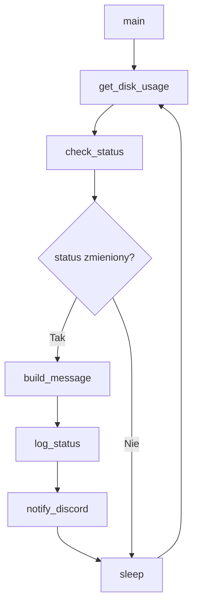

# Disk Health Checker 💾

Prosty, ale rozbudowywany monitor wolnego miejsca na dysku napisany w Pythonie.  
Skrypt działa w pętli, zbiera metryki systemowe i raportuje stan dysku w czasie rzeczywistym do konsoli oraz pliku logów.

Projekt ewoluuje w kierunku lekkiego narzędzia typu **system health monitor / lightweight observability agent**.

---

## 📋 Spis treści
- [Funkcje](#-funkcje)
- [Architektura](#-architektura)
- [Wymagania](#-wymagania)
- [Instalacja i uruchomienie](#-instalacja-i-uruchomienie)
- [Konfiguracja](#-konfiguracja)
- [Struktura logów](#-struktura-logów)
- [Konfiguracja Discord](#-konfiguracja-discord)
- [Obsługa błędów](#-obsługa-błędów)
- [Plany rozwoju (Roadmap)](#-plany-rozwoju-roadmap)

---

## ✨ Funkcje

- **Monitoring w czasie rzeczywistym**  
  Cykliczne sprawdzanie stanu dysku w zadanym interwale.

- **Rozszerzone metryki systemowe**  
  Zbieranie danych o:
  - użytej przestrzeni
  - całkowitej pojemności
  - wolnym miejscu (GB i %)

- **Wielopoziomowe statusy zdrowia systemu**
  - `OK`
  - `WARNING`
  - `CRITICAL`

- **State tracking (zmiana stanu)**  
  Logowanie tylko przy zmianie statusu systemu (redukcja szumu logów).

- **Podwójne logowanie**
  - terminal (stdout)
  - plik `disk_health.log`

- **Ustrukturyzowany format logów**  
  Każdy wpis zawiera hostname, ścieżkę dysku, status i metryki w czytelnym formacie.

- **Wykrywanie systemu operacyjnego**  
  Automatyczny dobór ścieżki dysku (`/` dla Linux/macOS, `C:\` dla Windows).

- **Obsługa błędów systemowych**  
  Stabilność działania w przypadku problemów OS lub uprawnień.

- **Integracja z Discord (Webhooks) 🔔**  
  Natychmiastowe powiadomienia o zmianie stanu dysku wysyłane bezpośrednio na kanał Discord.
  
- **Bezpieczna konfiguracja**  
  Separacja wrażliwych danych (Webhook URL) od logiki programu dzięki wykorzystaniu zewnętrznego pliku `secrets.py`.


---

## 🧠 Architektura


Skrypt działa w prostym, liniowym modelu przetwarzania — każdy cykl pętli głównej przechodzi przez te same etapy:



**State tracking** — skrypt porównuje aktualny status z poprzednim (`previous_status`).  
Log jest zapisywany tylko wtedy, gdy stan się zmienił, co eliminuje powtarzające się wpisy.

---

## ⚙️ Wymagania

- Python 3.10+
- Biblioteki standardowe:
  - `shutil`
  - `time`
  - `logging`
  - `socket`
  - `platform`

---

## 🚀 Instalacja i uruchomienie

1. Sklonuj repozytorium lub pobierz plik:
```bash
git clone <repo-url>
```

2. Sprawdź wersję Pythona:

```bash
python --version
```

3. Uruchom skrypt:

```bash
python disk_health_checker.py
```

---

## 🛠️ Konfiguracja

Główne parametry systemu znajdują się w sekcji konfiguracji:

| Zmienna                  | Opis                           | Domyślnie                        |
| ------------------------ | ------------------------------ | -------------------------------- |
| `DISK_PATH`              | Monitorowana ścieżka dysku     | `/` (Linux/macOS) lub `C:\` (Windows) |
| `MIN_FREE_PCT_WARNING`   | Próg ostrzeżenia (%)           | 20                               |
| `MIN_FREE_PCT_CRITICAL`  | Próg krytyczny (%)             | 5                                |
| `CHECK_INTERVAL_SECONDS` | Interwał sprawdzania (sekundy) | 120                              |
| `LOG_FILE`               | Nazwa pliku logów              | `disk_health.log`                |

---

## 📄 Struktura logów

Każdy wpis logu zawiera pełny kontekst stanu systemu w ustrukturyzowanym formacie:
YYYY-MM-DD HH:MM:SS,ms - LEVEL - STATUS: ... | HOSTNAME: ... | DISK: ... | NOTE: ... | USED: ...GB/...GB | FREE: ...GB (...%)

Przykład:

```text
2026-05-02 12:00:00,000 - INFO    - STATUS: OK       | HOSTNAME: my-pc | DISK: / | NOTE: Disk space OK    | USED: 12.30GB/100.00GB | FREE: 55.20GB (45.50%)
2026-05-02 12:02:00,000 - WARNING - STATUS: WARNING  | HOSTNAME: my-pc | DISK: / | NOTE: Low disk space   | USED: 80.10GB/100.00GB | FREE: 18.20GB (18.20%)
2026-05-02 12:04:00,000 - CRITICAL- STATUS: CRITICAL | HOSTNAME: my-pc | DISK: / | NOTE: Disk almost full | USED: 95.00GB/100.00GB | FREE: 2.50GB (2.50%)
```

---

## 🔑 Konfiguracja Discord

Aby otrzymywać powiadomienia:
1. Utwórz Webhook w ustawieniach swojego serwera Discord.
2. Utwórz w folderze głównym projekt plik `secrets.py`.
3. Dodaj do niego następującą linię:
   ```python
   DISCORD_WEBHOOK_URL = "TWÓJ_URL_WEBHOOKA_TUTAJ"
---

## ⚠️ Obsługa błędów

Skrypt obsługuje następujące klasy problemów:

* `FileNotFoundError` → brak pliku lub ścieżki
* `OSError` → problemy systemowe / API OS
* `PermissionError` → brak dostępu do zasobów
* `ZeroDivisionError` → problem z odczytem pojemności dysku
* `KeyboardInterrupt` → bezpieczne zatrzymanie procesu
* `Exception` → fallback dla nieprzewidzianych błędów (logowany ze szczegółami)

Każdy błąd jest logowany z odpowiednim poziomem ważności.

---

## 🚀 Plany rozwoju (Roadmap)

### Etap 1: Integracje alertów

* [x] Webhook (Discord)
* [ ] Email notifications (SMTP)

### Etap 2: Rozszerzenie monitoringu

* [ ] Obsługa wielu dysków / mount pointów
* [ ] Historia zużycia (trend analysis)

### Etap 3: Konfiguracja i skalowanie

* [ ] config.json / .env support
* [ ] CLI arguments (argparse)

### Etap 4: Observability upgrade

* [ ] eksport metryk (np. Prometheus format)
* [ ] dashboard HTML

---

## 👨‍💻 Autor

**Mateusz Markiewicz**  
Projekt rozwijany w ramach nauki Python / Linux / System Administration  
Cel: przygotowanie do pierwszej pracy w IT (Helpdesk / Junior Sysadmin / IT Ops)
